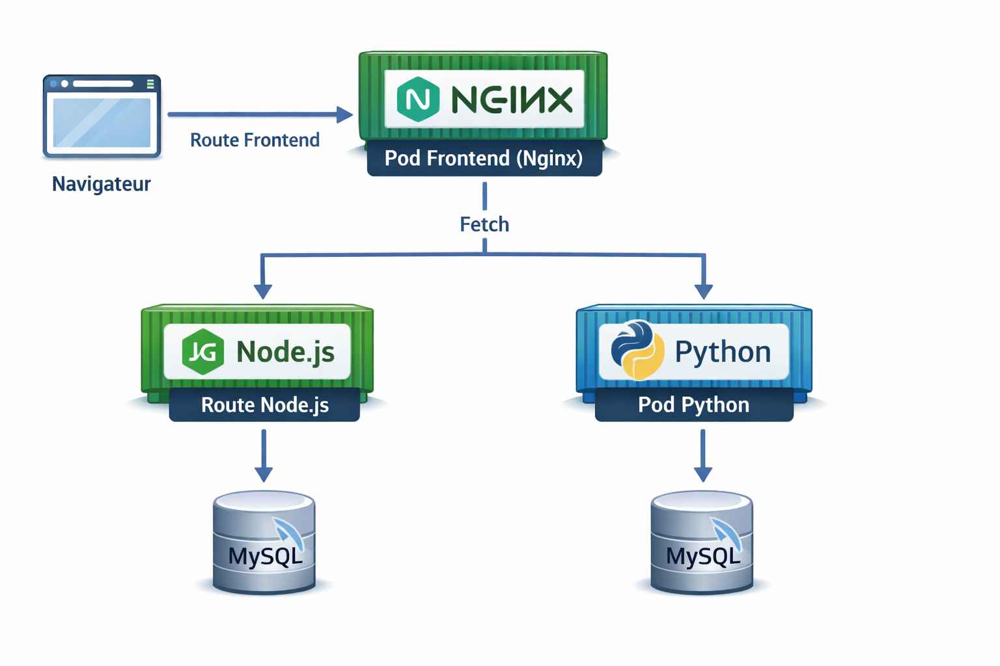
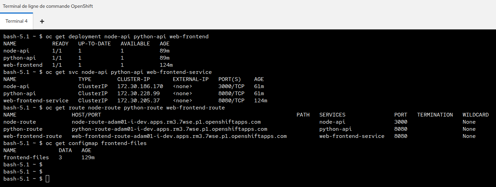
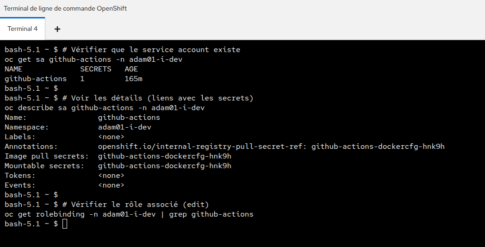
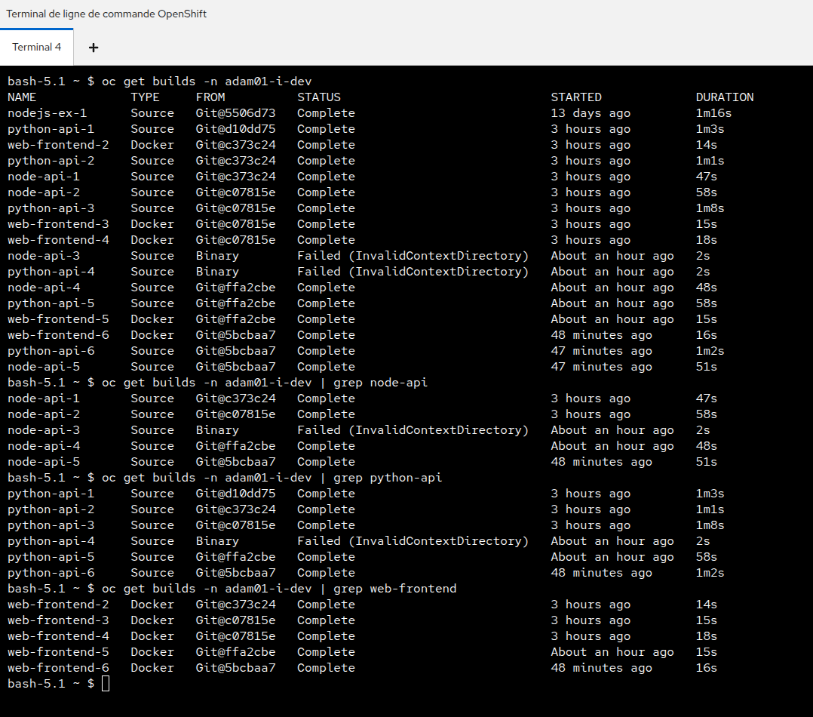
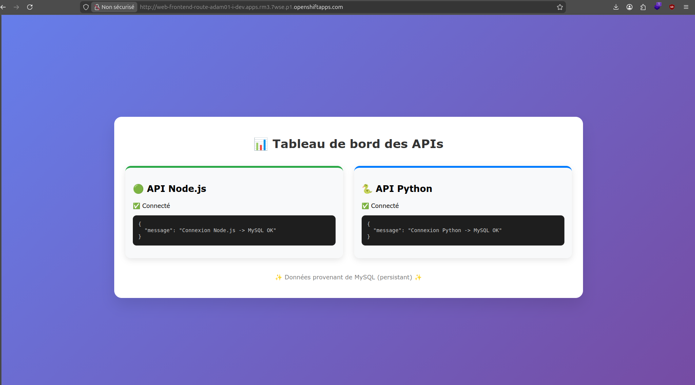
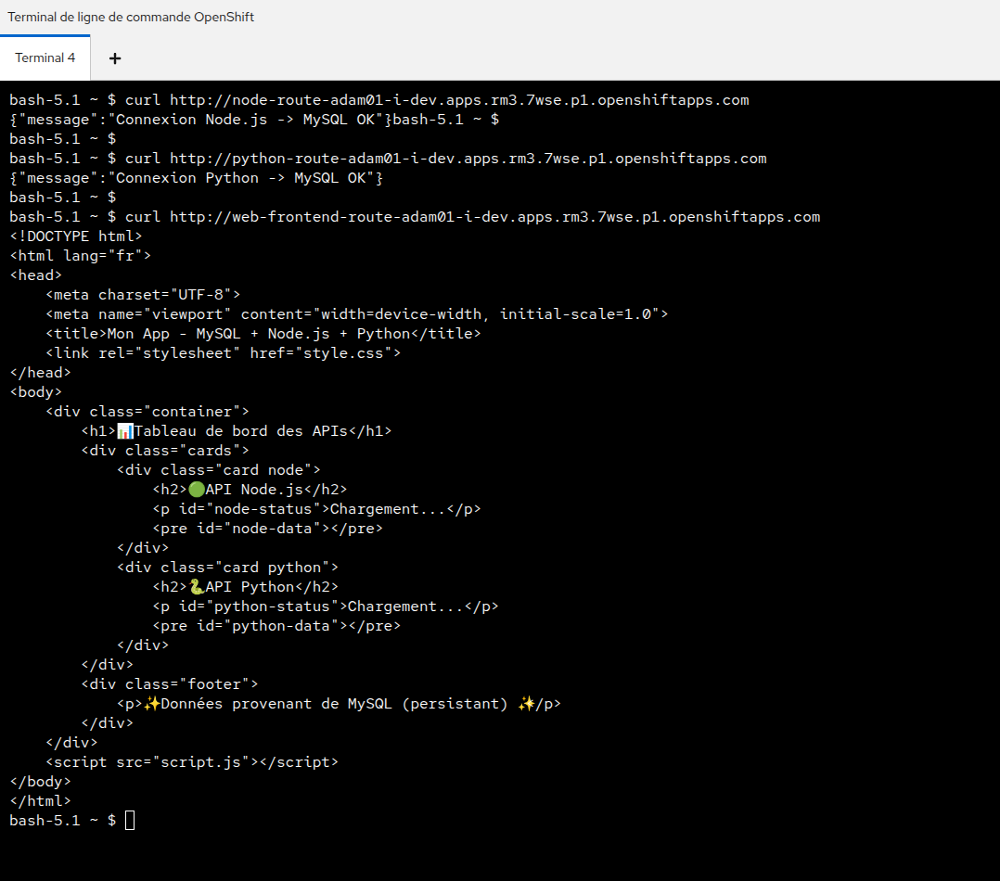

---

# 📄 RAPPORT COMPLET — DÉPLOIEMENT D'UNE APPLICATION WEB SUR OPENSHIFT AVEC CI/CD

## 🎯 Contexte et objectifs

Dans le cadre d'un projet pratique, l'objectif était de déployer une application web complète sur un **cluster OpenShift en mode sandbox**, avec les contraintes suivantes :

* Utilisation de **deux machines virtuelles (KubeVirt)** initialement, puis abandon de celles-ci au profit de pods classiques pour des raisons de stabilité
* Mise en place d'une **base de données MySQL persistante**
* Développement de **deux API** (Node.js et Python) communiquant avec MySQL
* Création d'un **frontend statique** (HTML/CSS/JS) pour afficher un tableau de bord interrogeant les deux API
* Mise en place d'une **intégration continue / déploiement continu (CI/CD)** via **GitHub Actions** : à chaque `git push`, les applications sont automatiquement reconstruites et redéployées sur OpenShift

Ce rapport détaille l'ensemble des actions menées, des problèmes rencontrés et des solutions adoptées, en s'appuyant sur l'historique complet de la session de travail.

---

## 🏗️ Architecture finale

| Composant       | Technologie                           | Accès                                     | Persistance           |
| --------------- | ------------------------------------- | ----------------------------------------- | --------------------- |
| Base de données | MySQL 8                               | Service interne `mysql-service:3306`      | PVC `mysql-pvc` (5Gi) |
| API Node.js     | Node.js 22 + `mysql2`                 | Route HTTP `node-route` (port 3000)       | —                     |
| API Python      | Flask + `pymysql` + `flask_cors`      | Route HTTP `python-route` (port 8080)     | —                     |
| Frontend        | Nginx (`nginxinc/nginx-unprivileged`) | Route HTTP `web-frontend-route` (port 80) | —                     |
| CI/CD           | GitHub Actions                        | Workflow sur push `main`                  | —                     |

### 🔗 Schéma des communications



---

## 🔐 NetworkPolicies mises en place

* `allow-all-internal` : autorise toutes les communications entre pods du même namespace
* `allow-from-openshift-ingress` : autorise le trafic entrant depuis le namespace du routeur OpenShift (non fonctionnel en sandbox, mais conservée)
* `allow-all-ingress` : autorise tout trafic entrant (utilisée pour les tests)

---

### 2. 🗄️ Déploiement de MySQL avec persistance

#### 📦 PersistentVolumeClaim

```yaml
apiVersion: v1
kind: PersistentVolumeClaim
metadata:
  name: mysql-pvc
spec:
  accessModes:
    - ReadWriteOnce
  resources:
    requests:
      storage: 5Gi
```

#### 🚀 Déploiement MySQL

```yaml
apiVersion: apps/v1
kind: Deployment
metadata:
  name: mysql
spec:
  replicas: 1
  selector:
    matchLabels:
      app: mysql
  template:
    metadata:
      labels:
        app: mysql
    spec:
      containers:
        - name: mysql
          image: mysql:8
          env:
            - name: MYSQL_ROOT_PASSWORD
              value: rootpass
            - name: MYSQL_DATABASE
              value: webdb
            - name: MYSQL_USER
              value: webuser
            - name: MYSQL_PASSWORD
              value: webpass_
          ports:
            - containerPort: 3306
          volumeMounts:
            - name: mysql-storage
              mountPath: /var/lib/mysql
      volumes:
        - name: mysql-storage
          persistentVolumeClaim:
            claimName: mysql-pvc
```

#### 🔌 Service MySQL

```bash
oc expose deployment mysql --name=mysql-service --port=3306
```

---

### 3. 🧩 Création des ConfigMaps

#### 🟢 Node.js (`server.js`)

```javascript
const mysql = require('mysql2');
const http = require('http');

const connection = mysql.createConnection({
  host: 'mysql-service.adam01-i-dev.svc.cluster.local',
  user: 'webuser',
  password: 'webpass_',
  database: 'webdb',
  port: 3306
});

const server = http.createServer((req, res) => {
  res.setHeader("Access-Control-Allow-Origin", "*");
  res.setHeader("Access-Control-Allow-Methods", "GET, OPTIONS");
  res.setHeader("Access-Control-Allow-Headers", "Content-Type");

  if (req.method === "OPTIONS") {
    res.writeHead(204);
    res.end();
    return;
  }

  connection.connect(err => {
    if (err) {
      res.writeHead(500, {'Content-Type': 'application/json'});
      res.end(JSON.stringify({error: "Erreur connexion DB"}));
      return;
    }

    connection.query(
      'SELECT "Connexion Node.js -> MySQL OK" as message',
      (err, results) => {
        if (err) {
          res.writeHead(500);
          res.end(JSON.stringify({error: err.message}));
          return;
        }

        res.writeHead(200, {'Content-Type': 'application/json'});
        res.end(JSON.stringify(results[0]));
      }
    );
  });
});

server.listen(3000, "0.0.0.0", () => console.log("API running on port 3000"));
```

---

#### 🐍 Python (`Flask`)

```python
import pymysql
from flask import Flask, jsonify
from flask_cors import CORS

app = Flask(__name__)
CORS(app)

def get_db_connection():
    return pymysql.connect(
        host='mysql-service.adam01-i-dev.svc.cluster.local',
        user='webuser',
        password='webpass_',
        database='webdb',
        port=3306,
        cursorclass=pymysql.cursors.DictCursor
    )

@app.route('/')
def index():
    try:
        conn = get_db_connection()
        with conn.cursor() as cursor:
            cursor.execute("SELECT 'Connexion Python -> MySQL OK' as message")
            result = cursor.fetchone()
        conn.close()
        return jsonify(result)
    except Exception as e:
        return jsonify({"error": str(e)}), 500

if __name__ == '__main__':
    app.run(host='0.0.0.0', port=8080)
```

---

### 4. 🚀 Déploiement des APIs et du frontend

#### Node.js

```bash
oc new-app https://github.com/Adam01-i/my-webapp --context-dir=backend-node --name=node-api
oc expose svc node-api --name=node-route
```

#### Python

```bash
oc new-app https://github.com/Adam01-i/my-webapp --context-dir=backend-python --name=python-api
oc expose svc python-api --name=python-route
```

#### Frontend

```bash
oc create configmap frontend-files \
  --from-file=index.html \
  --from-file=style.css \
  --from-file=script.js
```


---

### 5. 🌐 Résolution des problèmes réseau

#### a) NetworkPolicy interne : allow-all-internal

```yaml
apiVersion: networking.k8s.io/v1
kind: NetworkPolicy
metadata:
  name: allow-all-internal
spec:
  podSelector: {}
  ingress:
    - from:
        - podSelector: {}
  policyTypes:
    - Ingress
```

---

#### b) NetworkPolicy interne : allow-from-openshift-ingress

```yaml
apiVersion: networking.k8s.io/v1
kind: NetworkPolicy
metadata:
 name: allow-from-openshift-ingress
spec:
 ingress:
 - from:
 - namespaceSelector:
 matchLabels:
 kubernetes.io/metadata.name: openshift-ingress
 podSelector: {}
 policyTypes:
 - Ingress
```

---


### 6. 🔄 CI/CD avec GitHub Actions

#### 🔐 Création du service account

```bash
oc create sa github-actions -n adam01-i-dev
oc policy add-role-to-user edit -z github-actions -n adam01-i-dev
oc create token github-actions --duration=8760h -n adam01-i-dev
```



#### ⚙️ Workflow

```yaml
name: Deploy to OpenShift

on:
  push:
    branches: [ main, master ]

jobs:
  build-nodejs:
    runs-on: ubuntu-latest
    steps:
      - uses: actions/checkout@v4
      - name: Install OpenShift CLI
        uses: redhat-actions/openshift-tools-installer@v1
        with:
          oc: latest
      - name: Start Node.js build
        run: |
          oc login --token=${{ secrets.OPENSHIFT_TOKEN }} --server=${{ secrets.OPENSHIFT_SERVER }}
          oc start-build node-api --follow -n ${{ secrets.OPENSHIFT_NAMESPACE }}

  build-python:
    runs-on: ubuntu-latest
    steps:
      - uses: actions/checkout@v4
      - name: Install OpenShift CLI
        uses: redhat-actions/openshift-tools-installer@v1
        with:
          oc: latest
      - name: Start Python build
        run: |
          oc login --token=${{ secrets.OPENSHIFT_TOKEN }} --server=${{ secrets.OPENSHIFT_SERVER }}
          oc start-build python-api --follow -n ${{ secrets.OPENSHIFT_NAMESPACE }}

  build-frontend:
    runs-on: ubuntu-latest
    steps:
      - uses: actions/checkout@v4
      - name: Install OpenShift CLI
        uses: redhat-actions/openshift-tools-installer@v1
        with:
          oc: latest
      - name: Start frontend build
        run: |
          oc login --token=${{ secrets.OPENSHIFT_TOKEN }} --server=${{ secrets.OPENSHIFT_SERVER }}
          oc start-build web-frontend --follow -n ${{ secrets.OPENSHIFT_NAMESPACE }}
```

#### ⚙️ Resultats des builds


---

## ⚠️ Problèmes rencontrés et solutions

| Problème                | Solution                     |
| ----------------------- | ---------------------------- |
| VMs KubeVirt instables  | Passage aux pods             |
| Pod PHP non fonctionnel | Remplacement par Flask       |
| Nginx non-root          | `nginx-unprivileged`         |
| MySQL inaccessible      | NetworkPolicy                |
| Routes en 503           | Correction services + policy |
| CORS bloqué             | Ajout headers                |
| Webhooks GitHub 403     | GitHub Actions               |

---

## ✅ État final fonctionnel

* **Node.js** :
  [http://node-route-adam01-i-dev.apps.rm3.7wse.p1.openshiftapps.com](http://node-route-adam01-i-dev.apps.rm3.7wse.p1.openshiftapps.com)

* **Python** :
  [http://python-route-adam01-i-dev.apps.rm3.7wse.p1.openshiftapps.com](http://python-route-adam01-i-dev.apps.rm3.7wse.p1.openshiftapps.com)

* **Frontend** :
  [http://web-frontend-route-adam01-i-dev.apps.rm3.7wse.p1.openshiftapps.com](http://web-frontend-route-adam01-i-dev.apps.rm3.7wse.p1.openshiftapps.com)



---

## 🧪 Tests

### Commandes test des routes api ainsi que le frontend
```bash
curl http://node-route-adam01-i-dev.apps.rm3.7wse.p1.openshiftapps.com
curl http://python-route-adam01-i-dev.apps.rm3.7wse.p1.openshiftapps.com
curl http://web-frontend-route-adam01-i-dev.apps.rm3.7wse.p1.openshiftapps.com/
```

### Resultats des tests



---

## 📎 Conclusion

Le projet a atteint tous ses objectifs :

* Application web complète et fonctionnelle
* Base de données persistante
* APIs Node.js et Python opérationnelles
* Frontend dynamique
* CI/CD automatisé
* Résolution des problèmes techniques majeurs

---

## 🔗 Liens

* GitHub : [https://github.com/Adam01-i/my-webapp](https://github.com/Adam01-i/my-webapp)
* Application : [http://web-frontend-route-adam01-i-dev.apps.rm3.7wse.p1.openshiftapps.com](http://web-frontend-route-adam01-i-dev.apps.rm3.7wse.p1.openshiftapps.com)

---